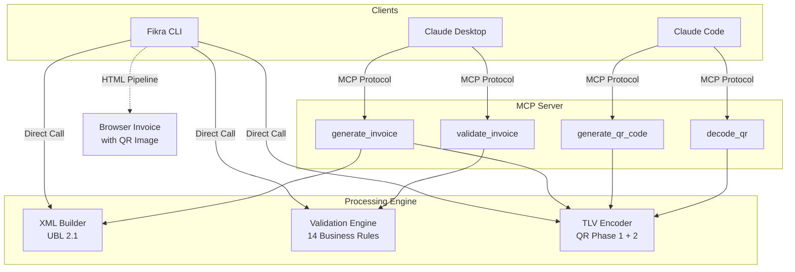

<div align="center">

# 🇸🇦 ZATCA MCP

**AI-native Saudi e-invoicing — generate ZATCA-compliant invoices from natural language.**

[](https://python.org)
[](LICENSE)
[](.github/workflows/test.yml)
[]()
[](https://modelcontextprotocol.io)
[]()

</div>

<!-- screenshot: add asciinema/VHS terminal recording here -->
<!-- <p align="center"></p> -->

---

## Why ZATCA MCP?

Saudi Arabia's ZATCA mandate requires **all businesses** to issue structured electronic invoices — Phase 1 (generation) since December 2021, Phase 2 (integration) rolling out across taxpayer waves through 2025. This is a cornerstone of **Vision 2030** digital transformation.

**The problem:** no open-source, AI-native tooling exists for ZATCA e-invoicing. Businesses either pay for proprietary ERP plugins or build compliance from scratch.

**This project:** the first open-source MCP server for Saudi e-invoicing — letting AI agents like Claude generate, validate, and manage ZATCA-compliant invoices through natural conversation.

## Features

- **4 MCP Tools** — generate invoices, QR codes, validate compliance, decode QR data
- **UBL 2.1 XML** — full namespace-compliant invoice generation per OASIS standard
- **14-Rule Validation Engine** — BR-01 through BR-14 business rule checks
- **TLV QR Encoding** — Phase 1 + Phase 2 tag support (tags 1-8)
- **Fikra CLI** — Claude Code-style conversational agent with HTML invoice output
- **49 Tests** — unit, integration, and edge-case coverage
- **CI/CD Pipeline** — ruff + mypy + pytest across Python 3.10/3.11/3.12
- **Arabic Support** — full UTF-8 handling for seller/buyer names and addresses
- **Decimal Precision** — `Decimal` with `ROUND_HALF_UP` for all financial math
- **Multi-Rate VAT** — per-line-item VAT rates (default 15%)

## Architecture



## Quick Start

### Install

```bash
pip install zatca-mcp
```

### Use with Claude Desktop

Add to `~/.claude/claude_desktop_config.json`:

```json
{
  "mcpServers": {
    "zatca": {
      "command": "zatca-mcp"
    }
  }
}
```

Restart Claude Desktop. You can now ask Claude to generate ZATCA-compliant invoices.

### Fikra CLI

```bash
export ANTHROPIC_API_KEY="sk-ant-..."
git clone https://github.com/DoubleH10/zatca-mcp.git
cd zatca-mcp
pip install -e ".[dev]"
python examples/fikrah_agent.py
```

## Fikra CLI

A Claude Code-style conversational agent that turns natural language into compliant invoices with professional HTML output.

**Features:**
- Gradient ASCII banner with `#c8e64a` brand theming
- `❯` prompt with streaming responses
- `⏺` tool-use indicators (mirrors Claude Code UX)
- Auto-generates HTML invoices with embedded QR code images
- Opens invoices in your browser automatically
- Token usage display (`↳ input · output tokens`)
- `/help` `/clear` `/quit` commands

```
     ◇
    ◇◆◇
     ◇       ███████╗██╗██╗  ██╗██████╗  █████╗ ██╗  ██╗
    ╱ ╲      ██╔════╝██║██║ ██╔╝██╔══██╗██╔══██╗██║  ██║
   ╱   ╲     █████╗  ██║█████╔╝ ██████╔╝███████║███████║
   ╰───╯     ██╔══╝  ██║██╔═██╗ ██╔══██╗██╔══██║██╔══██║
              ██║     ██║██║  ██╗██║  ██║██║  ██║██║  ██║
              ╚═╝     ╚═╝╚═╝  ╚═╝╚═╝  ╚═╝╚═╝  ╚═╝╚═╝  ╚═╝

  Model: claude-sonnet-4-20250514  |  Tools: 4 ZATCA tools  |  cwd: ~/zatca-mcp

  Tips: "I sold 10 laptops at 3000 SAR each to TechCo" to get started
        /help for commands, /quit to exit

❯ I just closed a deal with Al-Rajhi Corp for consulting — 10 hours at 500 SAR

  ⏺ generate_invoice

  ✓ Invoice saved & opened in browser
  ~/zatca-mcp/examples/invoices/INV-2026-001_20260217.html

  Great news on closing the deal! I've generated a ZATCA-compliant invoice
  for Al-Rajhi Corp — 10 hours of consulting at 500 SAR each.

  **Invoice Summary:**
  - Subtotal: 5,000.00 SAR
  - VAT (15%): 750.00 SAR
  - **Total: 5,750.00 SAR**

  The HTML invoice with embedded QR code is open in your browser.

  ↳ 1,847 input · 312 output tokens
```

## Tools API Reference

<details>
<summary><code>generate_invoice</code> — Create a ZATCA-compliant UBL 2.1 XML e-invoice</summary>

Creates a complete XML invoice following Saudi Arabia's ZATCA e-invoicing standard. Supports both Standard (B2B) and Simplified (B2C) invoice types. Automatically calculates VAT, line totals, and embeds QR code data.

| Parameter | Type | Required | Description |
|-----------|------|----------|-------------|
| `invoice_type` | string | Yes | `"standard"` (B2B) or `"simplified"` (B2C) |
| `invoice_number` | string | Yes | Unique identifier (e.g., `"INV-2024-001"`) |
| `issue_date` | string | Yes | `YYYY-MM-DD` format |
| `seller_name` | string | Yes | Seller business name |
| `seller_vat` | string | Yes | 15-digit VAT number |
| `seller_address` | string | Yes | Seller street address |
| `seller_city` | string | Yes | Seller city |
| `buyer_name` | string | Yes | Buyer/customer name |
| `items` | string | Yes | JSON array: `[{"name": "...", "quantity": 1, "unit_price": 100.00, "vat_rate": 0.15}]` |
| `currency` | string | No | ISO currency code (default: `"SAR"`) |
| `buyer_vat` | string | No | Required for standard (B2B) invoices |
| `buyer_address` | string | No | Buyer street address |
| `buyer_city` | string | No | Buyer city |
| `note` | string | No | Optional invoice note |

**Returns:** Complete UBL 2.1 XML invoice string with embedded QR code.

</details>

<details>
<summary><code>generate_qr_code</code> — Generate a TLV-encoded QR code</summary>

Creates a Base64-encoded QR code payload following ZATCA's Tag-Length-Value (TLV) format for Phase 1 and Phase 2 compliance.

| Parameter | Type | Required | Description |
|-----------|------|----------|-------------|
| `seller_name` | string | Yes | Business/taxpayer name (Arabic or English) |
| `vat_number` | string | Yes | 15-digit Saudi VAT number |
| `timestamp` | string | Yes | ISO 8601 format (e.g., `"2024-01-15T10:30:00Z"`) |
| `total_amount` | string | Yes | Invoice total including VAT (e.g., `"1150.00"`) |
| `vat_amount` | string | Yes | Total VAT charged (e.g., `"150.00"`) |

**Returns:** JSON with `qr_base64` and `decoded_verification` data.

</details>

<details>
<summary><code>validate_invoice</code> — Check invoice XML against ZATCA business rules</summary>

Runs 14 business rule checks including required fields, VAT number format, mathematical accuracy of line totals and VAT calculations, and structural integrity of UBL 2.1 XML.

| Parameter | Type | Required | Description |
|-----------|------|----------|-------------|
| `invoice_xml` | string | Yes | Complete UBL 2.1 XML invoice string |

**Returns:** JSON with `is_valid` (boolean), `errors` (list), `warnings` (list), and `checks_run` (14).

</details>

<details>
<summary><code>decode_qr</code> — Decode a ZATCA TLV-encoded QR code string</summary>

Extracts all encoded tag values from an existing ZATCA QR code for verification or inspection.

| Parameter | Type | Required | Description |
|-----------|------|----------|-------------|
| `qr_base64` | string | Yes | Base64-encoded TLV string from a ZATCA QR code |

**Returns:** JSON with decoded tag names and their values.

</details>

## Programmatic Usage

```python
from zatca_mcp.utils.xml_builder import build_invoice_xml
from zatca_mcp.utils.tlv import encode_tlv
from zatca_mcp.utils.validation import validate_invoice_xml

# Generate invoice
xml = build_invoice_xml(
    invoice_type="simplified",
    invoice_number="INV-2024-001",
    issue_date="2024-01-15",
    seller_name="Fikrah Tech",
    seller_vat="300000000000003",
    seller_address="123 King Fahd Road",
    seller_city="Riyadh",
    buyer_name="Walk-in Customer",
    line_items=[
        {"name": "AI Consulting", "quantity": 10, "unit_price": 500.00},
        {"name": "Setup Fee", "quantity": 1, "unit_price": 1000.00},
    ],
)

# Validate
result = validate_invoice_xml(xml)
print(f"Valid: {result['is_valid']}")  # True
print(f"Checks: {result['checks_run']}")  # 14

# Generate QR code
qr = encode_tlv(
    seller_name="Fikrah Tech",
    vat_number="300000000000003",
    timestamp="2024-01-15T10:00:00Z",
    total_amount="6900.00",
    vat_amount="900.00",
)
print(f"QR: {qr}")
```

## ZATCA Compliance

### Validation Rules (14 Business Rules)

| Rule | Check | Description |
|------|-------|-------------|
| BR-01 | Invoice ID | `cbc:ID` is mandatory |
| BR-02 | Issue Date | `cbc:IssueDate` mandatory, YYYY-MM-DD format |
| BR-03 | Type Code | `cbc:InvoiceTypeCode` must be 388, 381, or 383 |
| BR-04 | Currency | `cbc:DocumentCurrencyCode` is mandatory |
| BR-05 | Seller Name | Seller `RegistrationName` is mandatory |
| BR-06 | Seller VAT | 15-digit VAT number, starts/ends with 3 |
| BR-07 | Buyer Name | Buyer `RegistrationName` is mandatory |
| BR-08 | Buyer VAT (B2B) | Required for standard invoice subtype `01*` |
| BR-09 | — | Reserved |
| BR-10 | Line Items | At least one `cac:InvoiceLine` required |
| BR-11 | Line Math | qty × price = line extension amount (±0.01) |
| BR-12 | Tax Total | `cac:TaxTotal/cbc:TaxAmount` is mandatory |
| BR-13 | Payable Amount | `cbc:PayableAmount` is mandatory |
| BR-14 | Total Cross-Check | tax-exclusive + tax = tax-inclusive (±0.01) |

### Invoice Types

| Type | Code | Subtype | Use Case |
|------|------|---------|----------|
| Standard Tax Invoice | 388 | 0100000 | B2B transactions |
| Simplified Tax Invoice | 388 | 0200000 | B2C / POS transactions |

### QR Code TLV Tags

| Tag | Name | Phase |
|-----|------|-------|
| 1 | Seller Name | 1 |
| 2 | VAT Registration Number | 1 |
| 3 | Timestamp | 1 |
| 4 | Invoice Total (with VAT) | 1 |
| 5 | VAT Amount | 1 |
| 6 | Invoice Hash | 2 |
| 7 | ECDSA Signature | 2 |
| 8 | ECDSA Public Key | 2 |

> **Phase 2 note:** Tags 6-8 (cryptographic signing) are structurally supported in the TLV encoder. XAdES signing and ZATCA API integration are on the roadmap.

## Engineering Quality

- **49 tests** across 3 test modules (TLV, validation, invoice generation)
- **CI/CD** — GitHub Actions: ruff lint + format check, mypy type checking, pytest with coverage across Python 3.10 / 3.11 / 3.12
- **Decimal precision** — all financial calculations use `Decimal` with `ROUND_HALF_UP`, never floating point
- **UBL 2.1 compliance** — full OASIS namespace declarations (`ubl`, `cac`, `cbc`)
- **Arabic/UTF-8** — `ensure_ascii=False` throughout; Arabic seller/buyer names work correctly

## Project Structure

```
zatca-mcp/
├── src/zatca_mcp/
│   ├── server.py              # MCP server — 4 tool definitions
│   └── utils/
│       ├── xml_builder.py     # UBL 2.1 XML invoice generator
│       ├── validation.py      # 14-rule validation engine
│       └── tlv.py             # TLV QR encoder/decoder
├── examples/
│   └── fikrah_agent.py        # Fikra CLI conversational agent
├── tests/
│   ├── test_invoice.py        # Invoice generation tests
│   ├── test_tlv.py            # TLV encoding/decoding tests
│   └── test_validation.py     # Validation engine tests
├── .github/workflows/
│   └── test.yml               # CI pipeline
├── pyproject.toml
└── LICENSE
```

## Development

```bash
git clone https://github.com/DoubleH10/zatca-mcp.git
cd zatca-mcp
pip install -e ".[dev]"

# Tests
pytest tests/ -v

# Linting & types
ruff check src/ tests/
mypy src/zatca_mcp/ --ignore-missing-imports

# MCP Inspector (interactive testing)
mcp dev src/zatca_mcp/server.py
```

## Roadmap

- [x] TLV QR code generation (Phase 1 + Phase 2 tags)
- [x] UBL 2.1 XML invoice generation
- [x] 14-rule validation engine
- [x] MCP server with 4 tools
- [x] Fikra CLI (streaming, HTML invoices, QR images)
- [x] CI/CD pipeline (ruff + mypy + pytest matrix)
- [ ] XAdES digital signing (Phase 2)
- [ ] ZATCA API integration (sandbox + production)
- [ ] Certificate management (CSR generation)
- [ ] Credit/debit note support
- [ ] PyPI package publishing

## Built by Fikrah

[Fikrah](https://fikrah.ai) is building an agentic AI workforce for financial operations.
This MCP server is the foundation for our Saudi e-invoicing capabilities.

## License

Apache 2.0 — see [LICENSE](LICENSE)
